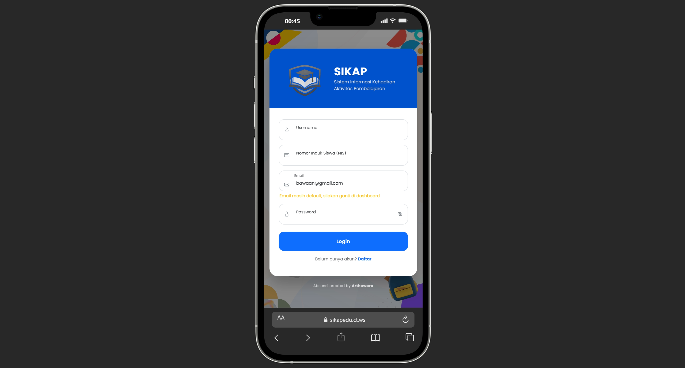
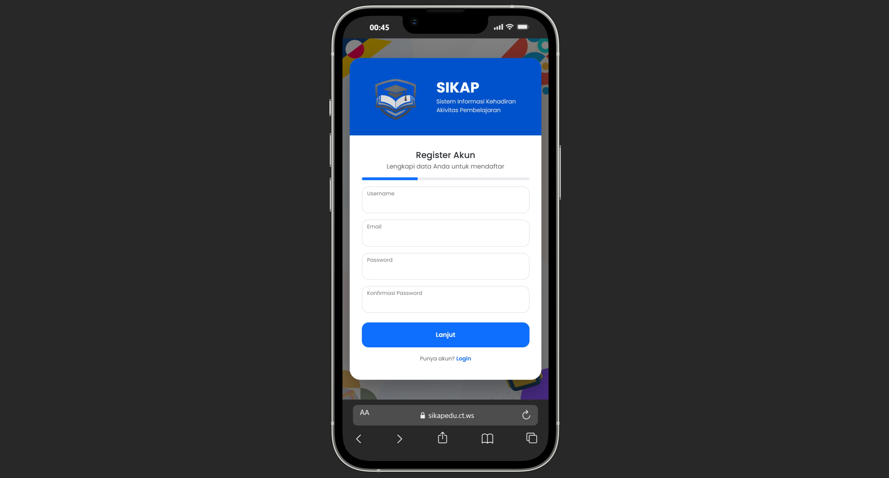
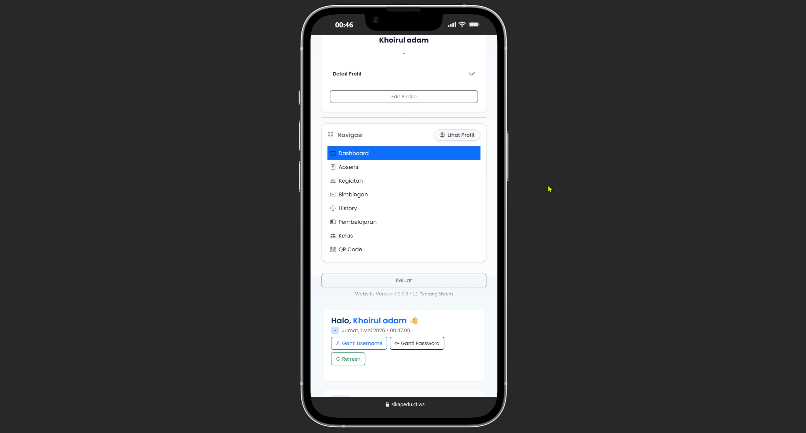

# 🌟 [SIKAP] - Sistem Informasi Kehadiran Aktivitas Pembelajaran

Aplikasi SIKAP (Sistem Informasi Kehadiran Aktivitas Pembelajaran) *Enterprise* yang dirancang untuk menangani alur kerja kompleks dengan performa tingkat tinggi. Dibangun dari nol menggunakan arsitektur **PHP Native**, sistem ini menawarkan kombinasi sempurna antara akselerasi pemrosesan data, keamanan berlapis, dan antarmuka visual yang sangat memanjakan mata.

---

## ✨ Skala Besar & Fitur Eksklusif

Sistem ini tidak hanya sekadar mencatat data, melainkan dirancang sebagai pusat kendali (*command center*) operasional:
*   🔐 **Role-Based Access Control (RBAC) Cerdas:** Pemisahan hak akses multi-level (Administrator, Manajer, Petugas) dengan presisi tingkat tinggi untuk melindungi modul-modul sensitif.
*   📈 **Analitik & Dasbor Eksekutif:** Visualisasi data *real-time* menggunakan *widget* interaktif dan grafik statistik untuk mendukung pengambilan keputusan.
*   🛡️ **Proteksi Data Berlapis:** Menerapkan validasi input ketat dan sanitasi data di setiap titik masuk untuk mencegah manipulasi sistem.
*   🔄 **Skalabilitas Modul:** Struktur direktori dan basis data dirancang agar siap menampung penambahan fitur baru tanpa merusak ekosistem yang sudah berjalan.

---

## 🎨 Kenyamanan Antarmuka (UI/UX)

*   📱 **Mobile-First & Responsif:** Tata letak *fluid* yang beradaptasi dengan sempurna—mulai dari layar saku *smartphone* hingga monitor *ultrawide* di ruang manajemen.
*   ✨ **Premium Glassmorphism:** Elemen antarmuka dirancang dengan efek kaca *translucent*, memberikan kesan modern, bersih, dan mewah yang setara dengan aplikasi *startup* global.
*   🎯 **Navigasi Intuitif:** Alur kerja (SOP) aplikasi dipetakan dengan cermat agar pengguna baru dapat mengoperasikan sistem tanpa memerlukan buku panduan yang tebal.

---

## 📸 Cuplikan Antarmuka (Showcase)

> Pamerkan keindahan antarmuka aplikasimu di sini.

### 1. Dasbor Utama & Ringkasan Analitik

*Tampilan awal (login).*

### 2. Modul Manajemen Data Terpadu

*Antarmuka Pendaftaran akun.*

### 3. Formulir Input & Validasi Pintar

*Dashboard dengan UI/UX yang memandu pengguna mengisi data dengan benar tanpa rasa frustrasi.*

---

## 🛠️ Stack Teknologi

*   **Bahasa Pemrograman:** PHP, Laravel 13
*   **Database:** MySQL
*   **Frontend:** HTML5, CSS3, JavaScript
*   **Visualisasi Data:** Chart.js
*   **Environment:** Docker

---
url aplikasi http://sikapedu.ct.ws/
